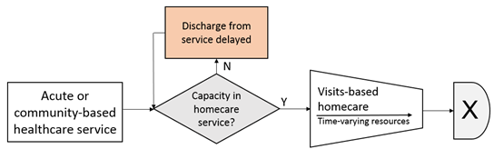

# STRESS-DES

*Strengthening the Reporting of Empirical Simulation Studies*

A standardised checklist to improve the reporting of discrete-event simulation models:
[Monks et al. 2019](https://doi.org/10.1080/17477778.2018.1442155)

## 1.0 Objectives
**1.1 Purpose of the model**

The visits-based simulation model provides a tool for community home care decision makers to support demand and capacity planning by evaluating the impact of alternative parameterisation on queues and other efficiency metrics.

**1.2 Model outputs**  

The routine model version is primarily used for time-dependent output and displays means and quantiles for:
*	The number of patients delayed
*	The wait time
*	The number of patients in service
*	The system cost of the scenario configuration
For this paper, means and 95% CI are outputed for the queue size (number of patients delayed) for time dependent outputs.

For steady state comparison, outputs with 95%CI are calculated using multiple replications for:
*	Mean queue size (number of patients delayed)
*	STDEV queue size
*	Variance queue size
*	Mean wait time
*	Mean service service utilisation
*	Queue skewness
*	Probability of queue

**1.3 Experimental aims**  

The experiments compare results between the visits-based simulation model, and complementary analytical approximations.
The LoS in days: 
*	~Bounded_Rounded
 Normal(μL, σL )
was bounded between 0.5 and 30.5 and discretised to the nearest day. 0-day LoS were resampled. 
*	Means are calculated to be equivalent to exponential mean=12 
*	High variation BRN(12.1304,6) and low variation BRN(12.489,4) models results are computed. 
*	Length of Stay (days) ~ Bounded_Rounded
Exponential(μL, )
was discretised to the nearest 1 day and 0-day LoS were resampled.  
Visit rates per day: 
*	Initial visit rate [IVR} ~ Bounded_Rounded
Normal(μI, σI )
bounded between 0.25 and 4.75 and discretised to nearest 0.5 hour 
*	Final visit rate [FVR} ~ Adjusted Bounded_Rounded
Normal(μF, σF )
bounded between 0.25 and 4.75 and discretised to nearest 0.5 hour.   
*	Means are calculated 
*	The FVR was set to the IVR where the sampled FVR>sampled IVR.
*	High variation (2.5:1) and low variation (2:1.7372) results are computed.  
*	Increasing values of arrival rates 4.75, 5, 5.25 and 5.5 are used. Typically, the system is operating at high levels of utilisation.  

## 2.0 Model logic
**2.1 Base model overview diagram**

**2.2 Base model logic**

Patients arrive into the visits-based home care service as daily batched arrivals following a Poisson process. Patients are generated a linear visit sequence, sampled from an initial visit requirement (IVR) and a final visit requirement (FVR). Where the visit sequence can not be accommodated by remaining visit capacity, the patient is delayed until the following day, and so on, until the service has adequate capacity to accommodate the visit sequence across the sampled length of stay.

**2.3 Scenario logic**

Experimentation stabilises the mean lengths-of-stay, and varies the length-of-stay variance, the length of stay distribution, the visit parameter variation, and the arrival rates.

**2.4 Components**

*	There is a single patient entity.
*	Arrivals determine traffic intensity: 4.75, 5.0, 5.25, 5.5 per day
*	A single service node (home care) followed by discharge
*	Resources are represented as number of visits, or visit hours capacity = 125 visit slot per day of 0.5 hour duration. 
*	Queues are held in prior to service, representing delayed discharge. The queue discipline is FIFO except in the instance where there are no available resources to start a service at time *t*, an arriving patient is scheduled to start at *t+1* so as not to hold back patients next in the queue who can be accommodated.
*	The model has a single entry and exit point.

## 3.0 Data

Data is routinely-collected from North Somerset Local Authority social care services.
Pre-processing was used to obtain model parameter; these were validated by social care staff.
Input parameters:
Time dependent and steady state arrival rates 4.75, 5.0, 5.25, 5.5
LoS distributions as described in 1.3, computed for comparison with analytical models.
IVR/FVR distributions as described in 1.3.
Assumptions:
	Queues are attributable to lack of visits-based capacity
	Visits-based capacity is static

## 4.0 Experimentation
**4.1 Initialisation**

The model is non-terminating.
The initial transient period can use a warm-up period or an initialisation method to approximate the current state at run-time.
For steady-state results, warm-up period was 1000 days, apart from high traffic intensity scenarios (arrival rate = 5.5) with 2000 days.

**4.2 Run Length**  

The model uses a time-slicing approach in days
Steady state results used a 1000 day run-length
Time-dependent results used 240/365 day run length
Multiple independent replications are undertaken to control confidence intervals. For model comparisons, multiple replications were undertaken using common random numbers between scenarios.

## 5.0 Implementation

**5.1 Software of programming language**

The simulation was developed using R 4.2.1.
The foreach package is used for parallel computing.

**5.2 Random sampling**

set.seed() is available in base R.

**5.3 Model execution**

The model implements a time-slicing approach. Unlike DES, which steps through discrete events in variable time periods, time-driven simulation considers a variable number of events within a fixed period of time.

**5.4 System specification**

The model was run on Intel i7-12700H CPU with 32GB RAM running Pop!_OS 22.04 Linux.                                                                                                                                                                                                                                                                                                                                                                                                                                                                                                                                                                                                                                        
## 6.0 Code access

Simulation model code is available from the main branch of the Githib repo [here](https://github.com/AliHarp/IPACS_visits_based_paper/tree/main).

Zenodo archive:

Model files:  
 
Outputs: 

 

